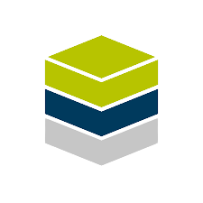

<!-- ### Hi there 👋 -->

 <a href="https://www.linkedin.com/in/abdul-samad-112ba923a/" target="_blank">

  

</a>

 

 
 
 
 #   About Me:
 
 - Hello👋, my name is <a href="https://www.linkedin.com/in/abdul-samad-112ba923a/" target="_blank">Abdul Samad</a> ,😎 and I'm a student at <a href="https://aitrichacademy.com/" target="_top">Airtch</a> studying software engineering. an introvert who chose computer science so that they could work alone. But who would have guessed that I would develop a passion for programming. Flutter💻📲 is my favourite programming language, and I love solving issues. One of the areas where I gained the most knowledge was GitHub.I'm interested in the UI UX Design,  backend-development, HTML & CSS, and JavaScript. Aim to contribute to the developer community.

------
<!--  -->
🔭 I’m currently working on  Full stack developer  🌱 I’m currently learning Web development 💬 Ask me about Flutter, HTML & CSS, Python, GitHub and git 

##  Tech Stack:

 
 
##  Socials:

 

 

<!-- 
**samadpr/samadpr** is a ✨ _special_ ✨ repository because its `README.md` (this file) appears on your GitHub profile.

Here are some ideas to get you started:

- 🔭 I’m currently working on ...
- 🌱 I’m currently learning ...
- 👯 I’m looking to collaborate on ...
- 🤔 I’m looking for help with ...
- 💬 Ask me about ...
- 📫 How to reach me: ...
- 😄 Pronouns: ...
- ⚡ Fun fact: ...
 -->
